   * [前言](#前言)
   * [项目部署](#项目部署)
      * [简要说明](#简要说明)
      * [资源清单](#资源清单)
      * [项目构建部署流程](#项目构建部署流程)
      * [从项目创建到一键发布](#从项目创建到一键发布)
         * [创建组织机构人员](#创建组织机构人员)
         * [创建项目](#创建项目)
         * [配置GitLab](#配置gitlab)
         * [配置介质仓库并与项目绑定](#配置介质仓库并与项目绑定)
         * [项目组件设计](#项目组件设计)
         * [添加服务资源](#添加服务资源)
         * [创建构建定义](#创建构建定义)
            * [damp_server_clear](#damp_server_clear)
            * [damp_server_construct](#damp_server_construct)
               * [拉取代码](#拉取代码)
               * [Maven执行](#maven执行)
               * [发布到Nexus](#发布到nexus)
               * [构建镜像](#构建镜像)
            * [damp_server_deploy](#damp_server_deploy)
               * [容器云部署](#容器云部署)
         * [创建发布定义](#创建发布定义)
         * [应用管理](#应用管理)
   * [服务安装](#服务安装)
      * [安装前准备](#安装前准备)
         * [介质下载](#介质下载)
         * [操作系统](#操作系统)
         * [关闭虚拟内存](#关闭虚拟内存)
         * [关闭安全模式](#关闭安全模式)
         * [关闭防火墙](#关闭防火墙)
         * [时间同步](#时间同步)
         * [安装|升级JDK](#安装升级jdk)
         * [指定主机名](#指定主机名)
         * [修改hosts](#修改hosts)
      * [k8s集群](#k8s集群)
         * [安装docker](#安装docker)
         * [安装kubelet](#安装kubelet)
         * [导入镜像包](#导入镜像包)
         * [初始化master](#初始化master)
         * [flannel](#flannel)
         * [heapster](#heapster)
            * [常见错误](#常见错误)
               * [创建后pods状态长期为ImagePullBackOff](#创建后pods状态长期为imagepullbackoff)
         * [加入node节点](#加入node节点)
         * [检查集群状态](#检查集群状态)
      * [harbor](#harbor)
         * [安装harbor依赖](#安装harbor依赖)
         * [安装harbor](#安装harbor)
         * [初始化基础镜像](#初始化基础镜像)
         * [为其他节点授权](#为其他节点授权)
         * [重启harbor](#重启harbor)
         * [常见错误](#常见错误-1)
            * [failed to initialize the system: read /etc/adminserver/key: is a directory](#failed-to-initialize-the-system-read-etcadminserverkey-is-a-directory)
            * [docker login harbor报错dial tcp x.x.x.x:443: getsockopt: connection refused](#docker-login-harbor报错dial-tcp-xxxx443-getsockopt-connection-refused)
      * [Jira](#jira)
         * [安装JIRA](#安装jira)
         * [初始化](#初始化)
         * [破解](#破解)
      * [Jenkins](#jenkins)
         * [安装](#安装)
         * [初始化](#初始化-1)
      * [Nexus](#nexus)
         * [安装](#安装-1)
         * [初始化](#初始化-2)
      * [GitLab](#gitlab)
         * [安装](#安装-2)
         * [初始化](#初始化-3)
      * [Arturo](#arturo)
         * [安装](#安装-3)
            * [arturo-server](#arturo-server)
               * [破解](#破解-1)
            * [arturo-page](#arturo-page)
         * [初始化](#初始化-4)
      * [Devops Server](#devops-server)
         * [安装](#安装-4)
            * [破解](#破解-2)
         * [初始化](#初始化-5)

# 前言

整个文档分为项目部署与服务安装两块。项目部署主要介绍devops的操作，比较简单。服务安装介绍整个安装过程与服务初始化，较为复杂。

所有的devops、k8s容器组件均已加入了虚拟局域网。这意味着你可以在外网通过虚拟局域网IP完成对项目开发、构建、发布的整套操作。

包括开发人员提交代码、运维人员一键编译部署、测试人员远程测试、远程提交bug等能力。

使得项目开发不在依赖本地服务，实现远程开发办公。

# 项目部署

整个方案涉及到以下组件：

Jenkins：用来执行流水线调度

Nexus：介质仓库，既提供maven私有仓库，又提供介质仓库供保存编译构建后的产物

Jira：需求、任务、bug管理

GitLab：代码库

Harbor：镜像仓库，构建编译后的镜像文件保存在此

K8s：容器调度集群

docker：容器

devops：基于tomcat的应用，提供组件整合方案

arturo：基于springboot的应用，提供界面来执行镜像部署与容器内的应用管理

zerotier client：虚拟局域网客户端

## 简要说明

目前使用了3台实体机，分别是192.168.5.103、192.168.5.104、192.168.5.108

- 192.168.5.103: 103上划分了3个虚拟机，用来组件K8S集群，目前集群提供20核 38G的资源供使用。后续可随时加入更多的节点来扩展集群节点，增加资源。后续如果资源充足可以将虚拟机节点换成实体机节点，这样性能更好。

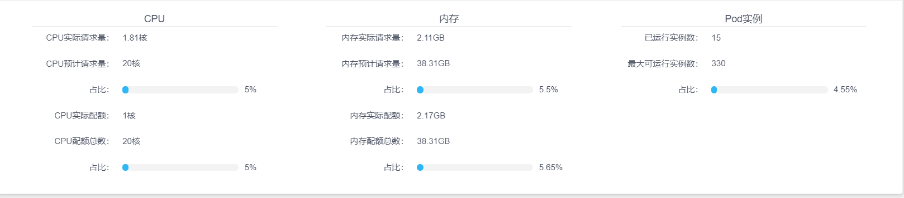

- 192.168.5.104：绝大多数的基础工具类组件部署在此，后期的所有基础工具都可以装在这台机器上，除了容器里的以外不要到处装了。
- 192.168.5.108：数据类组件部署在此。

## 资源清单

所有组件的安装部署情况见下表

| 实体机        | 虚拟机        | 说明                  | 用户名密码                 | 访问地址                   |
| ------------- | ------------- | --------------------- | -------------------------- | -------------------------- |
| 192.168.5.103 | 192.168.5.211 | k8s  master           |                            |                            |
| 192.168.5.212 | k8s  node1    |                       |                            |                            |
| 192.168.5.213 | k8s node2     |                       |                            |                            |
| 192.168.5.104 |               | jenkins               | sysadmin Sysadmin000       | http://192.168.5.104:8092/ |
|               | gitlab        | root     1234qwer     | http://192.168.5.104:8096/ |                            |
|               | jira          | sysadmin Sysadmin000  | http://192.168.5.104:8090/ |                            |
|               | devops        | sysadmin Sysadmin000  | http://192.168.5.104:8084/ |                            |
|               | arturo        | sysadmin     000000   | http://192.168.5.104:8300/ |                            |
|               | harbor        | admin     Harbor12345 | http://192.168.5.104/      |                            |
| 192.168.5.108 |               | mysql                 | data     data@12#$         |                            |
|               | nexus         | admin     admin123    | http://192.168.5.108:8081/ |                            |

## 项目构建部署流程

整个项目部署过程如下：

1. 开发人员将代码提交到GitLab上。
2. 运维人员在devops中点击一键部署。
3. devops使用jenkins，调用Gitlab获得项目代码，并储存在jenkins的工作空间中。
4. devops使用jenkins，在jenkins的工作空间中执行maven编译命令，将源码编译为jar包
5. devops使用jenkins，将编译好的jar包上传至nexus中保存。
6. devops使用jenkins，通过harbor中的基础镜像，将刚刚的jar包构建为项目镜像文件，并上传至harbor中保存。
7. devops使用jenkins，通过配置好的arturo地址，将项目镜像传至k8s集群中，并执行镜像启动命令。
8. 至此流水线完成，集群将为容器分配一个端口，arturo将ip+端口返回给devops，devops就可以通过ip+端口访问刚刚部署的应用了。

TODO:这里应该有个流程图

## 从项目创建到一键发布

下面简要的讲解一下如何创建一个新的项目，并创建流水线执行部署任务。

### 创建组织机构人员

首先第一步是使用系统管理员登录devops系统，进入【管理平台】-【组织机构】-【机构人员】界面，将项目所涉及的组织机构人员录入到系统中来。并同步到Jira与Gitlab两个组件中。

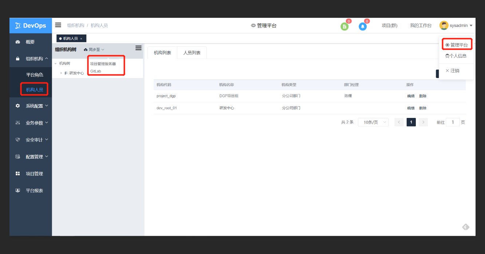

### 创建项目

在项目管理中新增项目

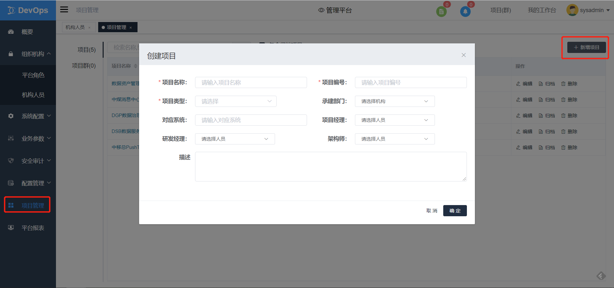

### 配置GitLab

在gitlab中创建对应的Group与Project，这里为了后续方便，我将Project设置为了Public。

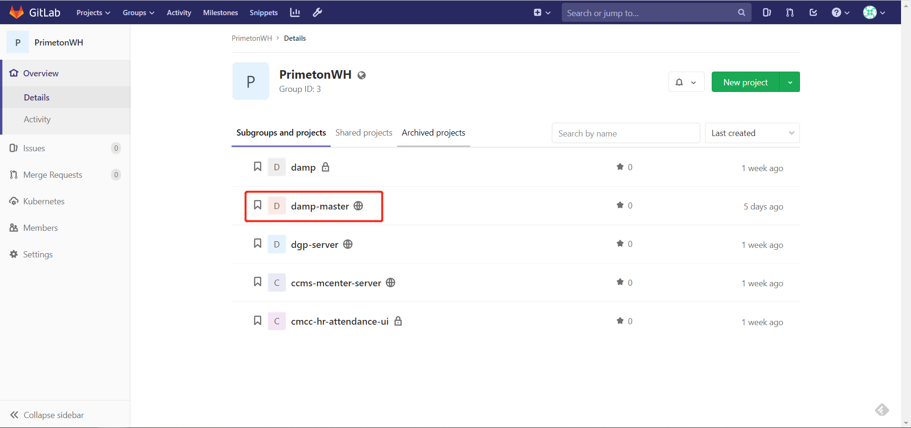

同时在devops系统中配置好这个Gitlab，并与创建的项目进行绑定。

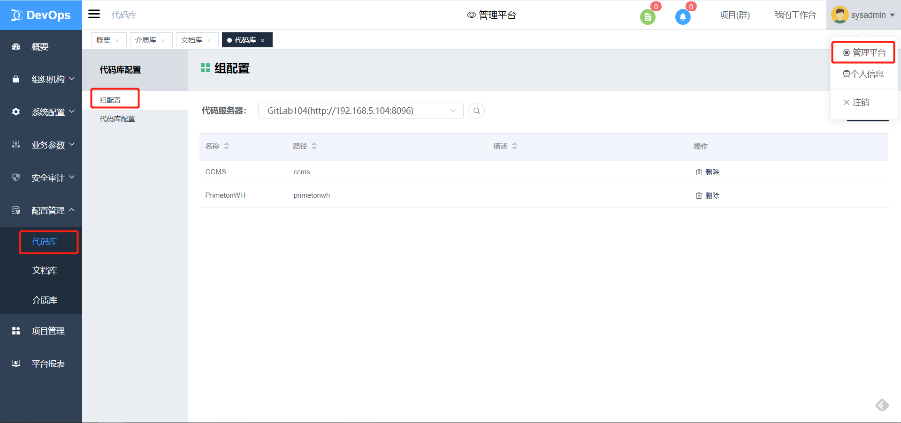

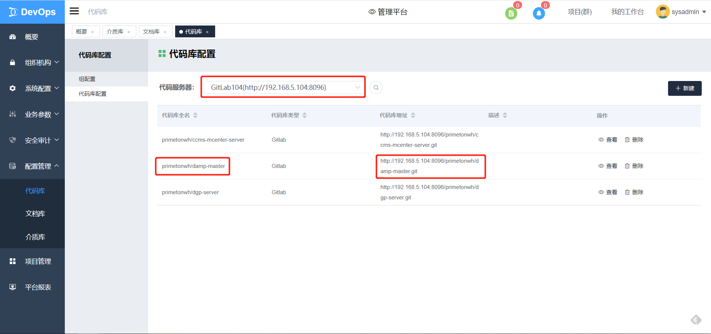

### 配置介质仓库并与项目绑定

一定要与项目进行绑定

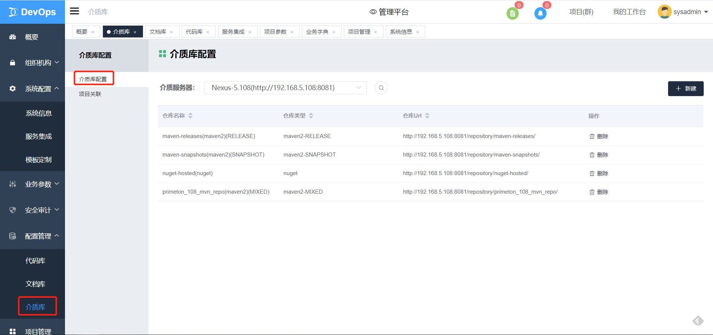

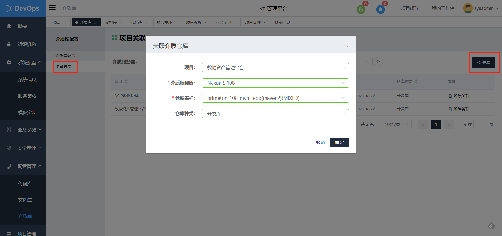

### 项目组件设计

进入项目界面，在【设计】-【组件】中，添加一个组件。

这里说一下我对组件的理解，这里组件的意思是项目的实际构成，比如拿damp举例。

damp采用前后端分离开发，整个项目分为前端与后端两个，前端的**部署形态**是生成的静态HTML文件部署在nginx或者tomcat中，后端的部署形态是一个springboot启动器的jar包。

那么如果要构建部署我们则需要将两块分开构建，前端组件为nginx或tomcat，后端组件为springboot。如果是微服务项目，那整个项目的后台会由多个springboot组件构成。

由于这里我只部署后端，所以只添加一个springboot的组件名为damp-boot。

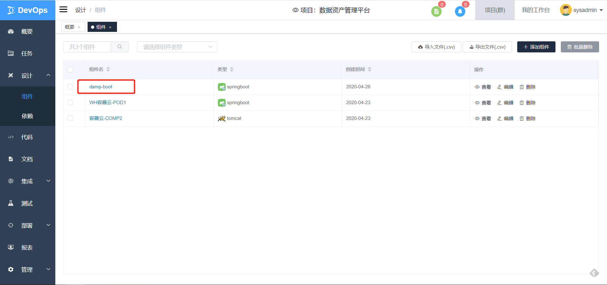

### 添加服务资源

需要描述我们构建后的产物部署在什么地方，所以需要新建资源。

资源分为两大类。一类叫云主机，指的是虚拟机。一类叫容器云，指的是容器集群。

由于我们有了k8s集群，所以无需再去手动创建虚拟机，我们只需要添加一个k8s集群的资源，所有的应用以后都可以部署在这个k8s集群中。

这里我额外的添加一个k8s集群master的虚拟机资源，原因是容器云产品有bug需要手动写脚本清理一些东西，我将脚本融合到了流水线操作中，在流水线中提交给集群master节点进行清理操作。

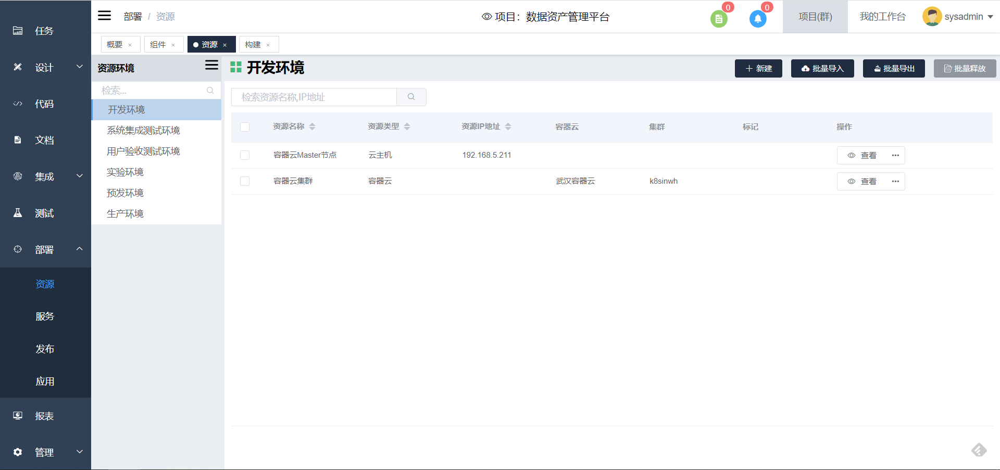

### 创建构建定义

以damp项目为例，这里只关注如何一键构建部署后台应用，前端暂不讨论。

damp项目创建了3个构建定义，分别是:

- damp_server_clear：由于容器云的bug，部署时不会自动清理上次部署的残余信息导致容器内资源占用冲突问题，所以添加此构建定义用于清理容器内的残留信息。
- damp_server_construct：拉取代码、编译代码、形成编译产出物jar包、生成此jar包的容器镜像用于后续部署到容器中。
- damp_server_deploy：将生成的构建产物（容器镜像）部署到容器中。

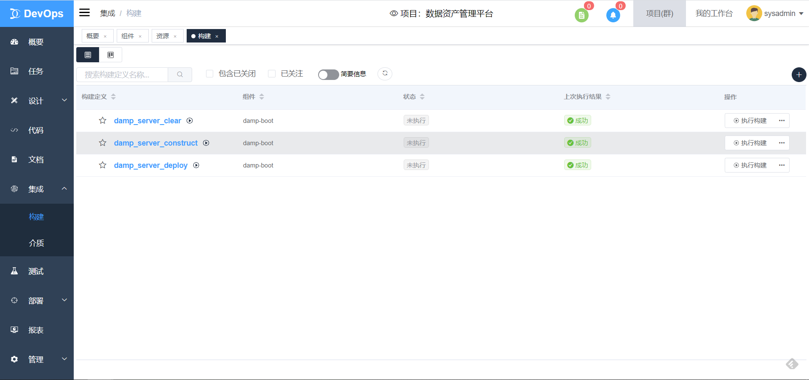

#### damp_server_clear

damp_server_clear用于清理容器内的残留资源，保证资源部署的时候不与之前部署的同项目资源产生冲突导致部署失败。

点击构建定义标题，进入构建定义信息页面，点击【编辑配置】，来到构建信息的配置界面。

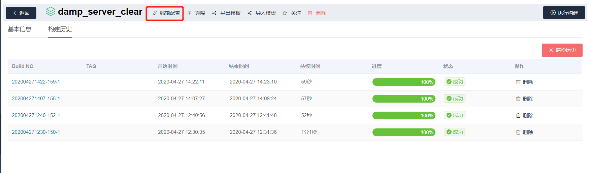

在概要界面我们需要填写以下信息

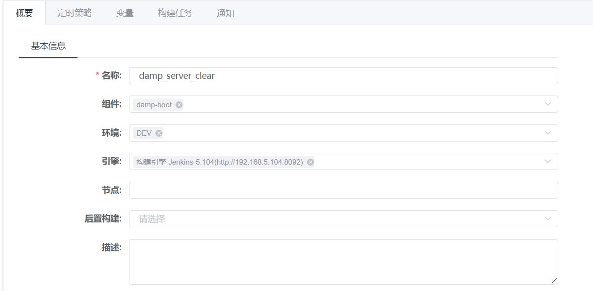

构建任务只有一个脚本执行，我们通过这个脚本执行来清除容器内的残留信息。

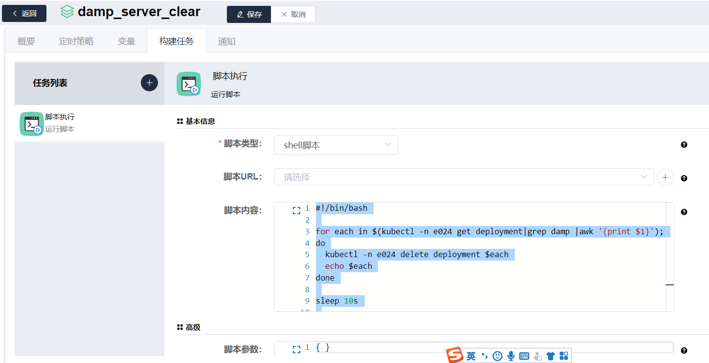

脚本内容如下

 

```
#!/bin/bash

for each in $(kubectl -n e024 get deployment|grep damp |awk '{print $1}');
do
  kubectl -n e024 delete deployment $each
  echo $each
done

sleep 10s

for each in $(kubectl -n e024 get service|grep damp |awk '{print $1}');
do
  kubectl -n e024 delete service $each
  echo $each
done

sleep 10s

for each in $(kubectl -n e024 get pods|grep damp |awk '{print $1}');
do
  kubectl -n e024 delete pods $each
  echo $each
done

sleep 10s

kubectl -n e024 get po,svc,deployment


echo "clear damp success!!!"
```

#### damp_server_construct

damp_server_construct用于拉取代码、并编译成部署介质。基本概要情况如下。

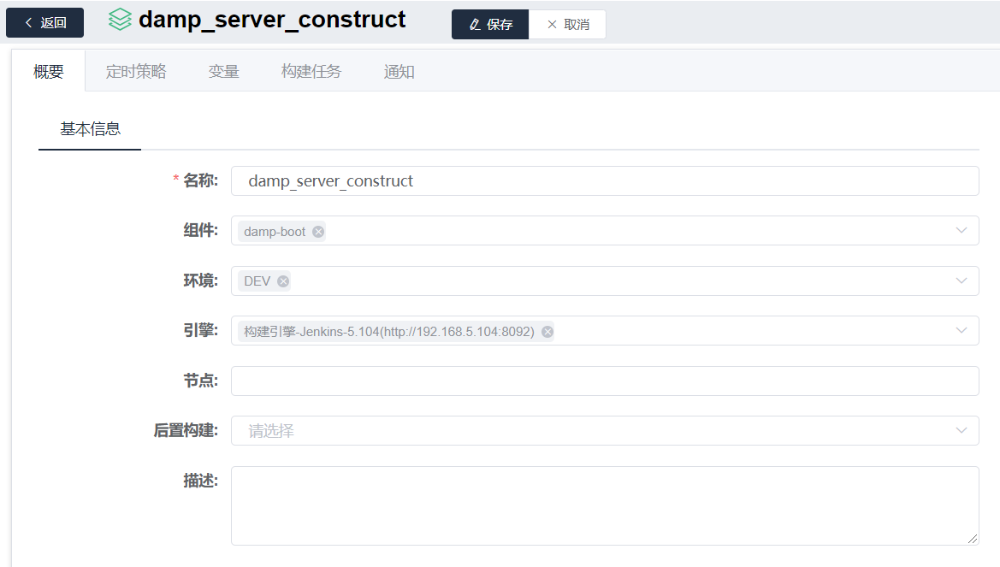

我们为damp_server_construct建一个变量信息，用来在后续的构建过程中控制版本号，变量信息作为构建的入参，也就是说每次构建会提示我输入这个变量。

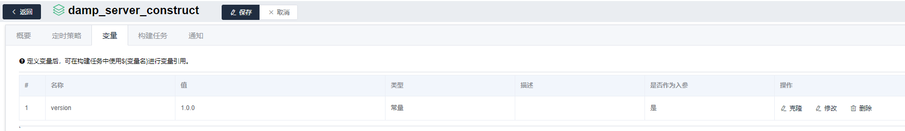

构建任务分为：**拉取代码**、**Maven执行**、**发布到Nexus**、**构建镜像**

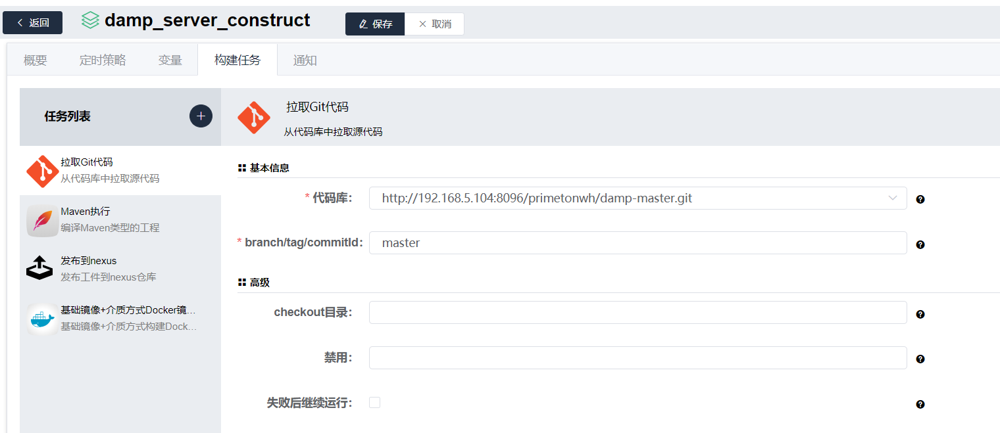

##### 拉取代码

没有什么特别的，配置代码库地址与分支就行了

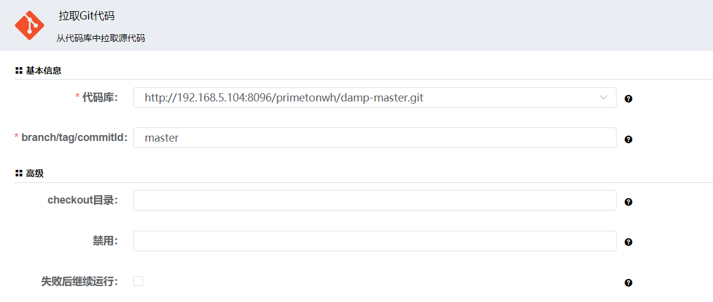

##### Maven执行

基本不用改，junit测试可以不勾选

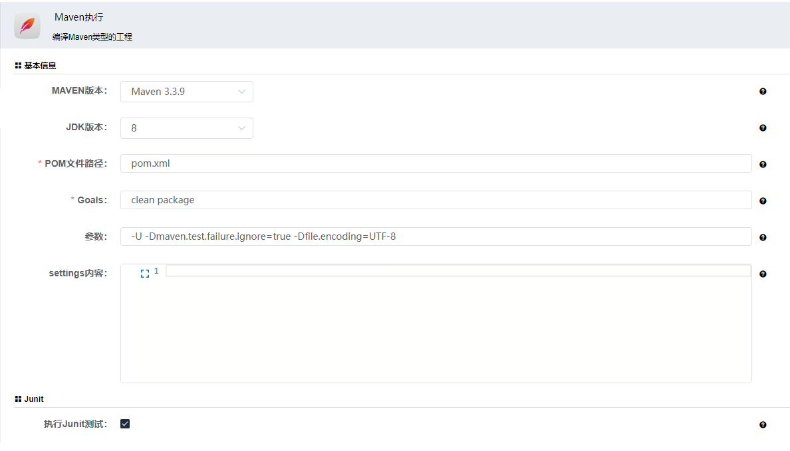

##### 发布到Nexus

这个要注意的地方比较多。

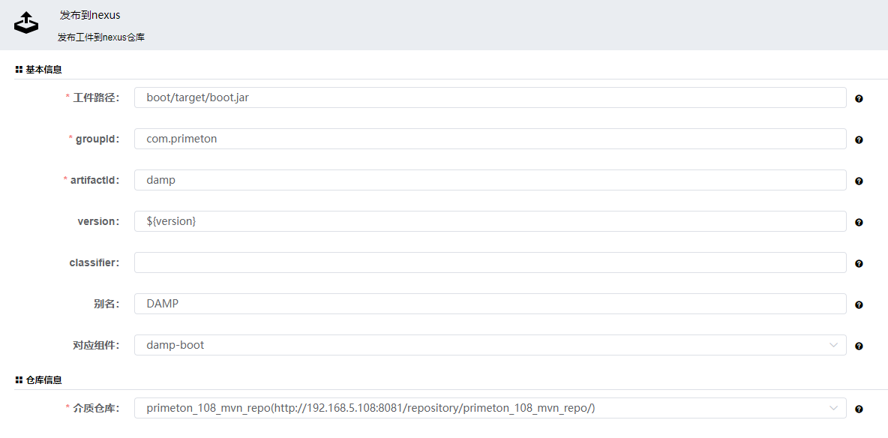

工件路径：这个地方应该填写你真实的构建的相对路径

groupid：

artifactid：这两个决定你的jar包被放在nexus下的哪个目录，比如这个上图的jar包最后被放在了primeton_108_mvn_repo仓库的com/primeton/damp/1.3.13/damp-1.3.13.jar路径下

version：前面创建的变量用在这里

别名：这个很重要，后续的部署来找jar包其实跟名称版本都无关，部署引擎会根据别名来找到jar包，所以这里取一个只属于你的项目的独一无二的名字。

##### 构建镜像

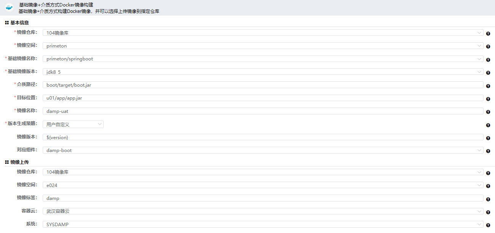

要点比较多，先说基本信息。这里需要最基础的docker基础知识，可以参考我的《docker学习笔记》

https://a265ec04.wiz03.com/wapp/pages/view/share/s/2ypuM42UVAsB2DwZDu14cdp62iiWRZ3xXAsk2WG4Ac0NhAwS  密码：4871

基本信息表示你要用哪个基础镜像来构建你的项目镜像

- 基本信息-镜像仓库：基础镜像的仓库，比如你要构建一个springboot，你应该了解你的应用镜像是构建在jdk上的，那么你的基础镜像就是jdk，需要去找一个符合要求的jdk镜像来作为基础镜像。
- 基本信息-镜像空间：同上。
- 基本信息-基础镜像名称：同上。
- 基本信息-基础镜像版本：同上。
- 基本信息-介质路径：填写真实构建后jar包的相对路径
- 基本信息-目标位置：固定写法，这是因为我们制作jdk基础镜像时设定的apphome就是这个目录/u01/app
- 基本信息-镜像名称：这个名称决定了你再容器中的应用名称，重复的名称在容器中会有冲突，需要取一个独一无二的。
- 基本信息-版本生成策略：
- 基本信息-镜像版本：自定义的版本，采用变量赋值，前面讲过
- 基本信息-对应组件：对应设计中的组件

镜像上传表示你的项目镜像的信息

- 镜像上传-镜像仓库：
- 镜像上传-镜像空间：固定写法
- 镜像上传-镜像标签：后续部署会根据标签来找到镜像，比如按最新版本部署时，会通过这个标签，找到此标签下的最新的镜像拿来部署
- 镜像上传-容器云：
- 镜像上传-系统：

#### damp_server_deploy

用来将镜像部署到容器集群中。

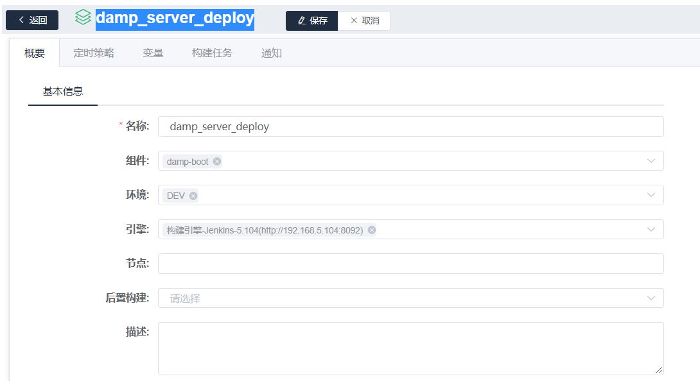

构建任务只有一个容器云部署

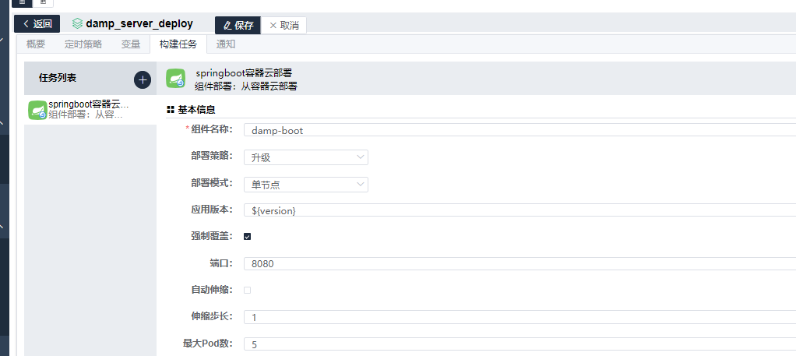

##### 容器云部署

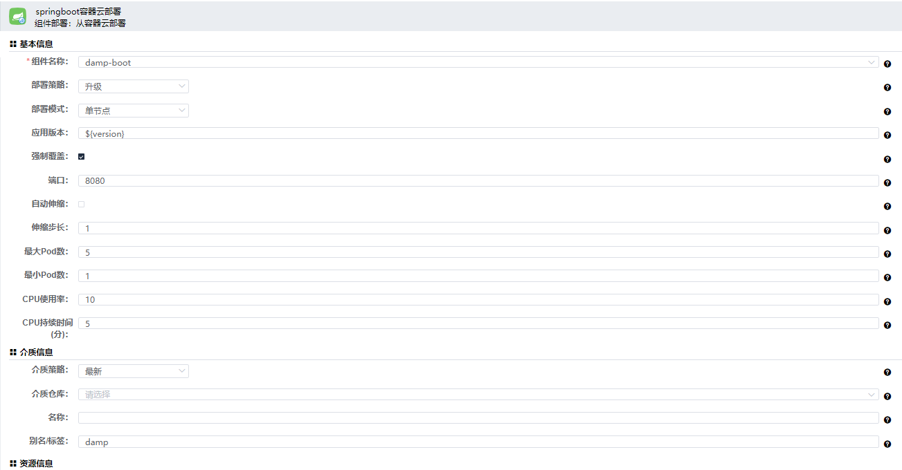

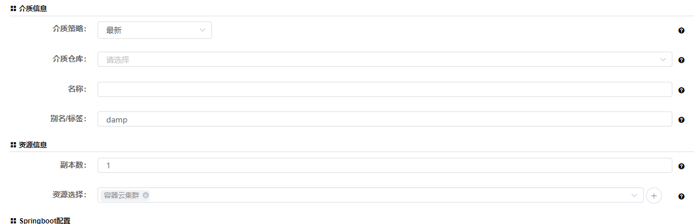

重点有以下几个：

- 介质信息-别名标签：这里表示根据damp标签找到最新的镜像信息，拿来部署
- 资源信息-资源选择：选择部署到哪个容器云集群中
- 资源信息-副本数：我们可以通过副本数来伸缩应用，k8s集群天然具有负载均衡功能，如果需要应用具备高可用、高负载、滚动发布等特性，可以通过调整副本数来创建多个实例。

### 创建发布定义

创建一个发布定义，用来将控制构建发布，

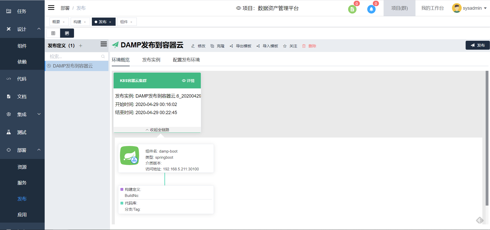

这个发布定义其实就是用来将前面3个构建定义按顺序排列,按顺序执行。

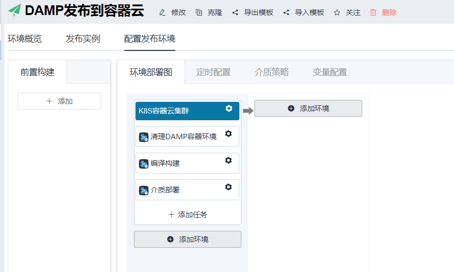

### 应用管理

应用发布成功后，可以在应用管理中看见应用了，应用会返回k8s集群的ip地址。

在部署时，应用会被自动部署给资源空闲的k8s集群节点，k8s集群天然自带负载均衡，通过访问master的ip就可以访问到。

同时我将master节点加入了虚拟局域网，所以可以在虚拟局域网通过虚拟IP，在外网访问你的应用。

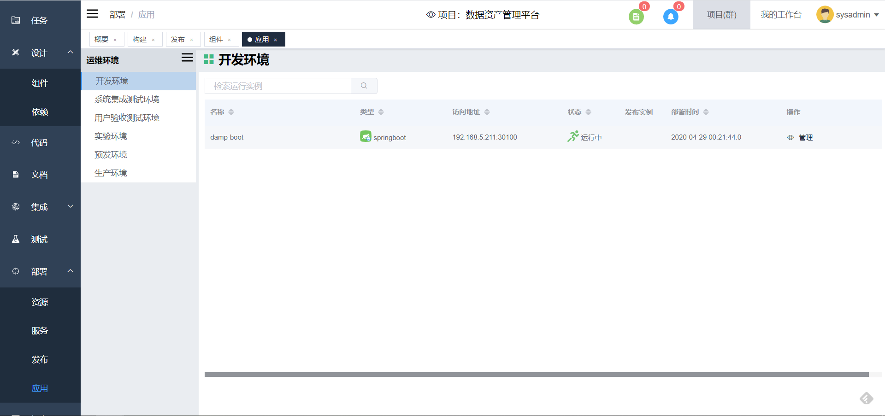

# 服务安装

## 安装前准备

其中这里计划的k8s集群是192.168.5.103上的3台虚拟机，虚拟机必须执行安装前准备的所有步骤。

至于其他两台不涉及k8s集群的实体机只需要做**关闭虚拟内存**、**关闭安全模式**、**关闭防火墙**、**时间同步**这几个步骤即可。

### 介质下载

这里我把安装需要到的介质统一放在这里供下载

 

```
#操作系统  CentOS-7-x86_64-DVD-1908.iso
http://mirrors.aliyun.com/centos/7/isos/x86_64/

#arturo
链接：https://pan.baidu.com/s/1-l4--oVSpnbo6m4c7sAXvA 
提取码：y32e 

#devops5.5
链接：https://pan.baidu.com/s/1-ir4ZSasAqWbIdoVV9tQsA 
提取码：g39e

#devops5.5的介质放在192.168.5.104上
#将介质DevOps5.5文件夹拷贝到/opt/devops
#进入介质文件夹
cd /opt/devops/DevOps5.5

#因为压缩文件是分卷的所以我们要先合并分卷后解压缩。
cat mirrors* > mirrorsX.tar.gz
#解压缩
tar xzvf mirrorsX.tar.gz
```

### 操作系统

 

```
#操作系统比较重要，至少要centos7，内核版本不要低于3.4，否在在安装网络组件时可能会有问题
#我在192.168.5.103上安装了3台虚拟机

#所安装的系统选用 CentOS-7-x86_64-DVD-1908.iso ， 可以在下面下载到
http://mirrors.aliyun.com/centos/7/isos/x86_64/

#采用带GUI的服务器模式安装
#内核版本 (uname -r) 为
# 3.10.0-1062.el7.x86_64
```

### 关闭虚拟内存

 

```
swapoff -a && sed -i '/ swap / s/^\(.*\)$/#\1/g' /etc/fstab
```

### 关闭安全模式

 

```
setenforce 0 && sed -i 's/^SELINUX=.*/SELINUX=disabled/' /etc/selinux/config
```

### 关闭防火墙

 

```
systemctl stop firewalld && systemctl disable firewalld
```

### 时间同步

 

```
#每台服务器都执行以下命令校准服务器时间
ntpdate cn.pool.ntp.org

#如果提示
#-bash: ntpdate: 未找到命令
#则安装ntp命令
yum -y install ntp
```

### 安装|升级JDK

 

```
https://a265ec04.wiz03.com/wapp/pages/view/share/s/2ypuM42UVAsB2DwZDu14cdp61sBJiz2Z3A5L2O7_Fz12Co0J  密码：9166
```

### 指定主机名

 

```
#在192,168,5,200 master1执行
hostnamectl set-hostname sk8s-103master01
#在192,168,5,201 node1执行
hostnamectl set-hostname sk8s-103node01
#在192,168,5,202 node2执行
hostnamectl set-hostname sk8s-103node02
```

### 修改hosts

 

```
vim /etc/hosts

192.168.5.211 sk8s-103master01
192.168.5.212 sk8s-103node01
192.168.5.213 sk8s-103node02
```

## k8s集群

首先我们需要安装k8s集群，这里假设你已经完成前面安装前准备的所有动作，所有动作都是**必须的**，**安装前准备工作**很大程度上决定了k8s集群安装是否顺利。

特别是关闭虚拟内存、关闭安全模式、关闭防火墙、时间同步四个步骤，一定要完成。

介质下载中的所有介质均以下载，后续提到的所有介质都在里面。

### 安装docker

 

```
#将离线包arturo-packages-offline.tar.gz拷贝至/home/k8s/arturo目录下 并解压缩
#pwd
#/home/k8s/arturo
tar zxvf arturo-packages-offline.tar.gz

#进入cd packages/ 目录解压docker.tar
tar xvf docker.tar

#安装docker
yum install -y localinstall docker/*.rpm

#安装完成后可以执行docker verion查看是否安装成功，然后启动docker并设置为开机启动
docker version
systemctl enable docker && systemctl start docker

```

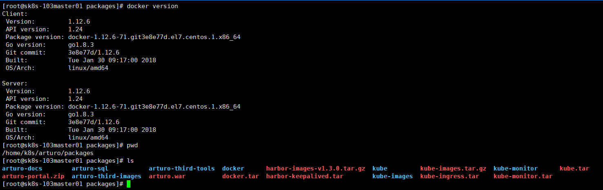

### 安装kubelet

 

```
tar xvf kube.tar
yum localinstall -y kube/*.rpm
systemctl enable kubelet && systemctl start kubelet
```

### 导入镜像包

 

```
tar zxvf kube-images.tar.gz

#镜像包的导入脚本需要根据镜像包的位置做相应的修改
vim kube-images/load-images.sh

if [ $1 == "master" ]; then
  for i in "${!master_images[@]}"; do
    docker load < /home/k8s/arturo/packages/kube-images/${master_images[$i]}.tar
  done
else
  for i in "${!node_images[@]}"; do
    docker load < ./kube-images/${node_images[$i]}.tar
  done
  
#修改完成后执行load-images.sh脚本，在master与node节点执行时略微有所不同，master节点执行时需要加上master
#master
./load-images.sh master
#node
./load-images.sh
```

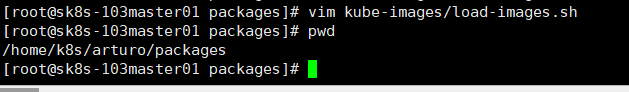

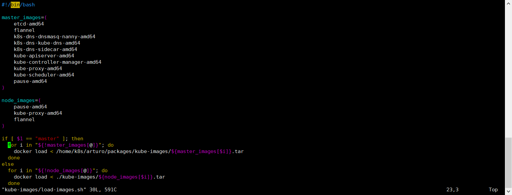

### 初始化master

仅master上操作

 

```
kubeadm init --apiserver-advertise-address 192.168.5.211 --kubernetes-version v1.8.7 --pod-network-cidr 10.244.0.0/16 --token-ttl 0
```

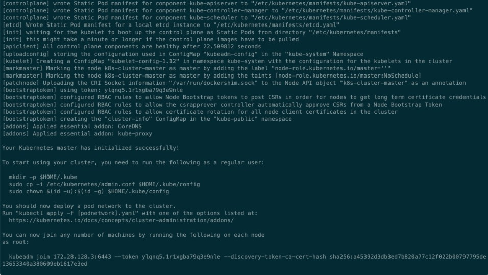

初始化成功后，根据提示，在master节点执行脚本迁移命令，将配置脚本移动到固定地点，master初始化成功的提示最好copy保存下来，后续加入节点还要用

 

```
mkdir -p $HOME/.kub
sudo cp -i /etc/kubernetes/admin.conf $HOME/.kube/config
sudo chown $(id -u):$(id -g) $HOME/.kube/config
export KUBECONFIG=/etc/kubernetes/admin.conf
```

### flannel

仅master上操作

 

```
cd kube-images
kubectl apply -f kube-flannel.yml
```

### heapster

监控&时序数据库，仅在master上操作

 

```
#解压安装介质包中的kube-monitor即可
tar xvf kube-monitor.tar
./kube-monitor/kube-monitor-install.sh

#有一点要注意的地方是，如果你的网络不能翻墙，建议要将monitor的组件镜像改为从国内渠道下载，方法如下：
cd kube-monitor/kube-monitor-yaml

#修改grafana.yaml  heapster.yaml  influxdb.yaml
#将image的地址前缀改为registry.cn-hangzhou.aliyuncs.com/inspur_research
#如registry.cn-hangzhou.aliyuncs.com/inspur_research/heapster-grafana-amd64:v4.4.3
```

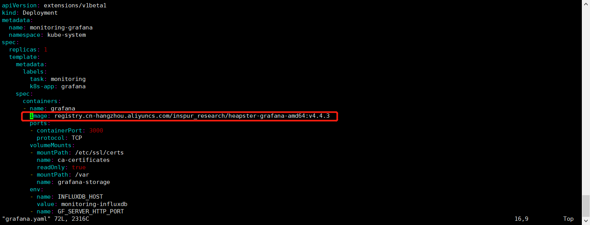

#### 常见错误

##### 创建后pods状态长期为ImagePullBackOff

 

```
#需要修改kube-monitor/kube-monitor-yaml文件夹下对应的3个yaml文件
# heapster.yaml
# influxdb.yaml
# grafana.yaml
#将3个里面所有的
image: gcr.io/google_containers/
#替换成
image: registry.cn-hangzhou.aliyuncs.com/inspur_research/

#比如gcr.io/google_containers/heapster-influxdb-amd64:v1.3.3
#替换成registry.cn-hangzhou.aliyuncs.com/inspur_research/heapster-influxdb-amd64:v1.3.3
```

### 加入node节点

此步骤仅在node节点上执行，在node节点上执行之前从master初始化成功后的加入语句，我这里是,你复制你之前初始化成功后的语句就可以了

 

```
kubeadm join 192.168.5.211:6443 --token abcdef.0123456789abcdef --discovery-token-ca-cert-hash sha256:37ee03bd63a4e429c9c8b4181e78243e4498d86a041d4bcc486d633ff6f58a00
```

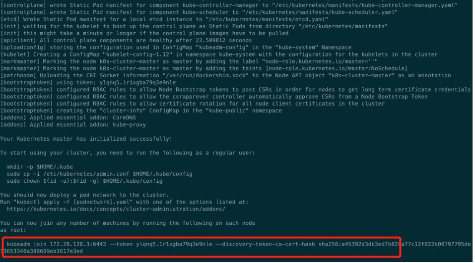

### 检查集群状态

在master上执行kubectl get nodes，查看集群状态

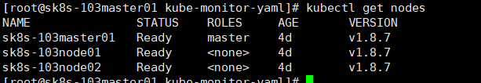

在master节点查看kube-system命名空间的pod、service、deployment状态，确定没有错误则集群初始化成功

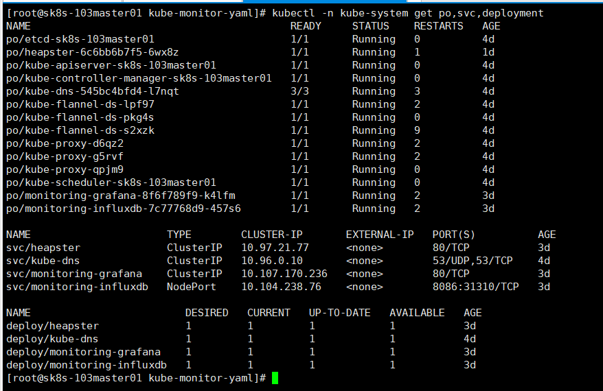

## harbor

安装介质见arturo\packages\harbor-images-v1.3.0

harbor推荐装在物理机上，它需要大量的磁盘空间，且需要保存重要的镜像介质文件。我选择装在192.168.5.104上。

Harbor的安装节点上**不要有mysql**，**必须有docker**，**80端口必须空闲，**没有安装docker的请先安装docker。

### 安装harbor依赖

 

```
sudo yum -y install python-pip
#如果出现以下错误：
#No package python-pip available
#则运行以下命令，安装epel：
yum -y install epel-release

pip install --upgrade backports.ssl_match_hostname
```

### 安装harbor

修改harbor.cfg

只修改hostname = 192.168.5.104，其他的都别动

执行.install.sh安装

安装成功后访问http://192.168.5.104即可访问

用户名密码为admin/Harbor12345

### 初始化基础镜像

初始化基础镜像需要对docker有一定的了解，了解如何制作镜像。

104上的harbor我已初始化好了，初始化过程过于繁琐后面再补充。

### 为其他节点授权

所有安装docker的节点，**包括安装jenkins节点**，特别是k8s集群中的所有节点，包括master、node1、node2，都需要执行以下步骤，来授权登录到harbor，否则将读取不到我们私有harbor中的基础镜像，无法完成部署。

 

```
#查找docker.service 所在的位置 
find / -name docker.service -type f
#/etc/systemd/system/docker.service

#修改文件
vim /etc/systemd/system/docker.service

#在ExecStart 加上--insecure-registry=192.168.5.104
ExecStart=/opt/kube/bin/dockerd --insecure-registry=192.168.5.104

#保存
#重启服务
systemctl daemon-reload
systemctl restart docker

#重启harbor
cd /opt/harbor/harbor-images-v1.3.0
docker-compose down
docker-compose up -d 
```

### 重启harbor

如果harbor出现问题，可以执行以下命令重启harbor

 

```
#停止并清除所有容器
docker-compose down

systemctl daemon-reload

#重启docker
service docker restart    
#启动harbor
docker-compose up -d 
```

### 常见错误

#### failed to initialize the system: read /etc/adminserver/key: is a directory

 

```
#起因是重启后harbor无法访问
#docker ps 查看容器
#结果显示vmware/harbor-adminserver:v1.3.0 状态是 Restarting (1) 23 seconds ago

#查看harbor-adminserver日志
tail -100 /var/log/harbor/adminserver.log

#提示
#failed to initialize the system: read /etc/adminserver/key: is a directory

#解决方法
##1. 停止并清除所有容器
docker-compose down

##2. 删除目录/data/secretkey
rm -rf /data/secretkey

##3. 执行tar包中的重载命令
./prepare

##4. 重新启动
docker-compose up -d
```

#### docker login harbor报错dial tcp x.x.x.x:443: getsockopt: connection refused

 

```
#查找docker.service 所在的位置 
find / -name docker.service -type f
#/etc/systemd/system/docker.service

#修改文件
vim /etc/systemd/system/docker.service

#在ExecStart 加上--insecure-registry=192.168.5.104
ExecStart=/opt/kube/bin/dockerd --insecure-registry=192.168.5.104

#保存
#重启服务
systemctl daemon-reload
systemctl restart docker

#重启harbor
cd /opt/harbor/harbor-images-v1.3.0
docker-compose down
docker-compose up -d 
```

## Jira

安装在192.168.5.104上

此组件属于devops的安装包里的内容，devops官方安装组件推荐的是ansible的方式安装，不想手动安装的可以参考官方文档

http://doc.primeton.com/pages/viewpage.action?pageId=30485701

### 安装JIRA

 

```
#创建文件夹
mkdir /opt/devops/manager/jira
chmod 777 /opt/devops/manager/jira

#将tar包拷贝过来
cd /opt/devops/manager/jira
cp /opt/devops/DevOps5.5/mirrors/software/jira/7/jira.tar /opt/devops/manager/jira
#解压缩
tar -xf jira.tar
```

### 初始化

在执行完jira自身的初始化后还需要导入一个普元的初始化模板，来初始化jira的template

这里参考普元的官方文档来初始化即可

http://doc.primeton.com/pages/viewpage.action?pageId=30485934

### 破解

[](wiz://open_attachment?guid=4d8a8003-7a51-4471-840f-ea8b50686736)

 

```
#将破解jar包拷到对应位置即可，记得导入DEVOPS53模板项目后再破解
scp atlassian-extras-3.2.jar root@192.168.5.104:/opt/devops/manager/jira/jira-7.3.1/atlassian-jira/WEB-INF/lib
```

## Jenkins

安装在192.168.5.104上

此组件属于devops的安装包里的内容，devops官方安装组件推荐的是ansible的方式安装，不想手动安装的可以参考官方文档

http://doc.primeton.com/pages/viewpage.action?pageId=30485701

### 安装

 

```
#创建目录
mkdir /opt/devops/jenkins/
chmod 777 /opt/devops/jenkins/

#拷贝安装介质
cd /opt/devops/jenkins
cp -r /opt/devops/DevOps5.5/mirrors/software/jenkins/2/* .


#解压缩
tar -xvf jenkins.tar
tar -xvf jenkins-tools.tar 

#启动
#可以修改start.sh来修改启动端口
/opt/devops/jenkins/./start.sh
/opt/devops/jenkins/./stop.sh

#查看日志
tail -f /opt/devops/jenkins/nohup.out

#访问#用户名/密码 sysadmin/Sysadmin000
http://192.168.5.104:8092
```

### 初始化

访问登录jenkins后，进入【Manage Jenkins】-【Configure System】菜单，对照下图检查配置

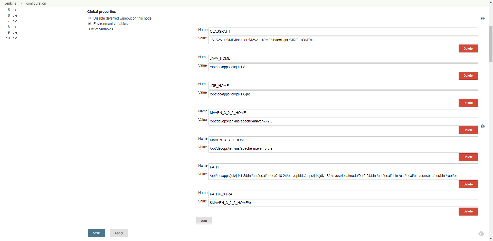

访问【Manage Jenkins】-【Configure Global Security】菜单，对照下图配置，重点注意Authorization

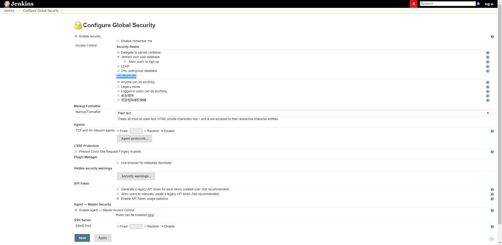

## Nexus

安装在192.168.5.108上

此组件属于devops的安装包里的内容，devops官方安装组件推荐的是ansible的方式安装，不想手动安装的可以参考官方文档

http://doc.primeton.com/pages/viewpage.action?pageId=30485701

### 安装

 

```
##
# 下面命令除特别标注外一律在108上运行
###


#创建文件夹
mkdir /opt/nexus
chmod 777 /opt/nexus
cd /opt/nexus/

#将介质拷贝过来 此条命令在104上运行
cp -r /opt/devops/DevOps5.5/mirrors/software/nexus/3/* /opt/devops/temp/

#解压缩
tar -xvf nexus.tar

#修改运行用户
vim /opt/nexus/bin/nexus.rc 
#run_as_user="root"

#修改配置 如果需要修改默认端口则改此处，我没有改默认8081
vim /opt/nexus/etc/nexus-default.properties

#创建文件夹用来储存nexus日志与数据
mkdir /opt/nexus/data
mkdir /opt/nexus/logs
chmod 777 /opt/nexus/data/
chmod 777 /opt/nexus/logs

#修改配置 修改日志储存位置与数据储存位置
vim /opt/nexus/bin/nexus.vmoptions
#-XX:LogFile 日志储存位置
#-Dkaraf.data 数据储存位置（这个要大）

#运行
#Usage: ./nexus {start|stop|run|run-redirect|status|restart|force-reload}
cd /opt/nexus/bin
./nexus start

#访问
http://192.168.5.108:8081

#默认用户名/密码
admin/admin123
```

## 

### 初始化

点击右上角【Sign In】登录后，可以看到设置按钮，点击设置按钮-【Repositories】进入仓库界面

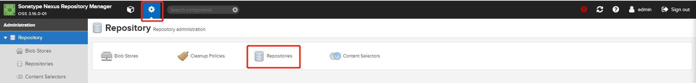

新建一个仓库，内容参考下图

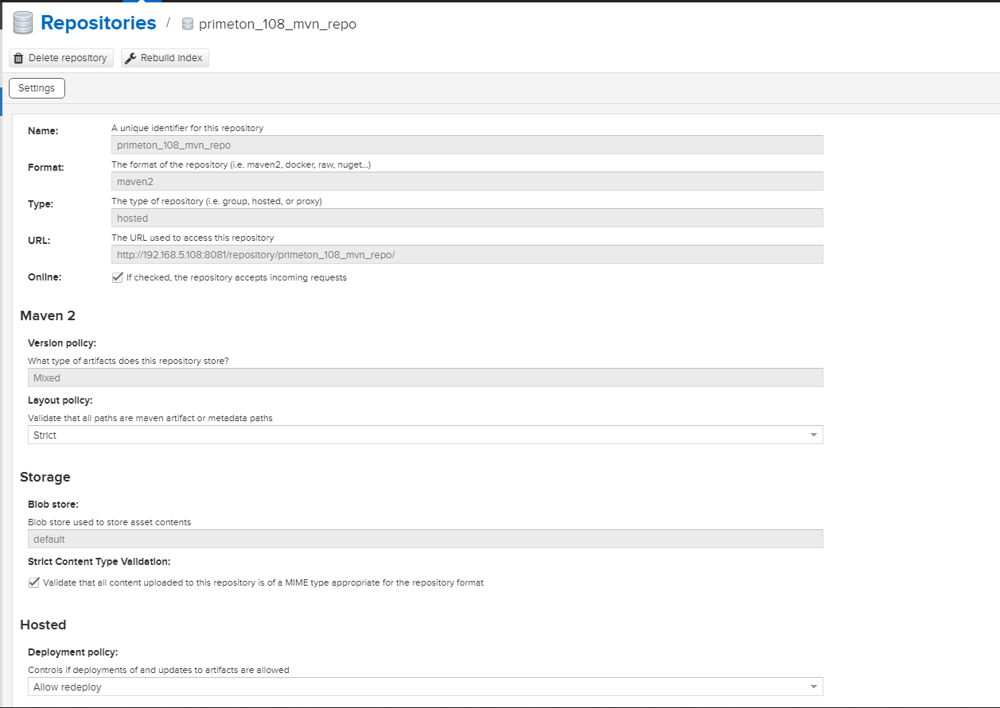


## GitLab

此组件属于devops的安装包里的内容，devops官方安装组件推荐的是ansible的方式安装，不想手动安装的可以参考官方文档

http://doc.primeton.com/pages/viewpage.action?pageId=30485701

### 安装

 

```
#创建目录
mkdir /opt/devops/codelab/
chmod 777 /opt/devops/codelab/

#拷贝介质包
cp /opt/devops/DevOps5.5/mirrors/packages/x86_64/gitlab-ce-12.3.5-ce.0.el7.x86_64.rpm /opt/devops/codelab/

#执行命令安装,ip地址换成一个可访问的地址
cd /opt/devops/codelab/
sudo EXTERNAL_URL="http://192.168.5.104:8096" yum localinstall gitlab-ce-12.3.5-ce.0.el7.x86_64.rpm

#登录刚才的地址即可看到Gitlab界面
http://192.168.5.104:8096

#初始管理员密码
root/1234qwer

#停止gitlab
sudo gitlab-ctl stop
#启动
sudo gitlab-ctl start
#重启
sudo gitlab-ctl restart
```

### 初始化

Gitlab的初始化没有什么要注意的，不讲了

## Arturo

安装在192.168.5.104上

### 安装

#### arturo-server

 

```
#创建文件夹
mkdir /opt/devops/arturo
chmod 777 /opt/devops/arturo

#上传介质(arturo-packages-offline.tar.gz)并解压
cd /opt/devops/arturo
tar -zxvf arturo-packages-offline.tar.gz

#拷贝一个tomcat过来，devops5.5的介质包里有，容器云的介质包里居然不放tomcat
cp /opt/devops/DevOps5.5/mirrors/software/tomcat/8.5/apache-tomcat-8.5.8.tar.gz /opt/devops/arturo/
#解压tomcat
tar -zxvf apache-tomcat-8.5.8.tar.gz
pwd & ll
/opt/devops/arturo
#目录结构如下
##total 2024732
##drwxr-xr-x 9 root root        160 Apr 21 15:16 apache-tomcat-8.5.8
##-rwxr-xr-x 1 root root    9323097 Apr 21 15:15 apache-tomcat-8.5.8.tar.gz
##-rw-r--r-- 1 root root 2063996843 Apr 21 14:56 arturo-packages-offline.tar.gz
##drwxr-xr-x 6 root root        311 Aug 14  2018 packages

#创建数据库并刷初始化脚本
#略

#拷贝arturo的war包
cp /opt/devops/arturo/packages/arturo.war /opt/devops/arturo/apache-tomcat-8.5.8/webapps/


#启动tomcat生成外置目录
#启动前记得修改conf/server.xml 里面的端口
#拷贝startServer.sh&stopServer.sh 两个文件到tomcat目录，并修改，注意stop需要修改端口号 start需要修改外置配置目录
cd /opt/devops/arturo/apache-tomcat-8.5.8
./startServer.sh

#启动后会报错，这个时候需要干2件事
#使用arturo代替ROOT
rm -rf /opt/devops/arturo/apache-tomcat-8.5.8/webapps/ROOT
mv /opt/devops/arturo/apache-tomcat-8.5.8/webapps/arturo /opt/devops/arturo/apache-tomcat-8.5.8/webapps/ROOT
mv /opt/devops/arturo/apache-tomcat-8.5.8/app_config/arturo /opt/devops/arturo/apache-tomcat-8.5.8/app_config/ROOT
#修改数据源
vim /opt/devops/arturo/apache-tomcat-8.5.8/app_config/ROOT/config/user-config.xml

#找一个mysql的链接包拷过来
cp /opt/primeton/arturo/packages/arturo/mysql-connector-java-5.1.46.jar /opt/devops/arturo/apache-tomcat-8.5.8/lib/

#把相关war包清理一下然后启动
./startServer.sh
#这个时候你会看见Primeton CaaS License is invalid, system will stop running.
#原因是arturo属于*******，自身不带license，你可以找cservice申请license，或者请看下章
```

##### 破解

 

```
#破解需要准备arturo下的两个文件，请先做好备份
/opt/devops/arturo/apache-tomcat-8.5.8/webapps/ROOT/WEB-INF/lib/ptp-server-l7e-5.1.4.0.jar
/opt/devops/arturo/apache-tomcat-8.5.8/app_config/ROOT/license/primetonlicense.xml
#然后通过技术手段破解
```

#### arturo-page

 

```
#前端查看安装包里的，arturo-portal.zip把他解压即可
mkdir /opt/devops/arturo/html
cd /opt/devops/arturo/html
unzip arturo-portal.zip

#安装nginx，此步骤略

#修改nginx配置文件
vim /etc/nginx/conf.d/default.conf

#listen 对应前端访问端口
#/api下得proxy_pass对应后台部署的ip与端口
server {
    listen       8300;
    server_name  localhost;
    location / {
        root   /opt/devops/arturo/html/dist;
        index  index.html index.htm;
    }

    location /api {
        proxy_pass http://127.0.0.1:8111/api;
        client_max_body_size 100m;
    }

    error_page   500 502 503 504  /50x.html;
    location = /50x.html {
        root   /usr/share/nginx/html;
    }
}


```

### 初始化

访问地址登录http://192.168.5.104:8300/，用户名sysadmin密码00000 

访问菜单-【设置】-【系统设置】，打开系统设置界面，分别设置镜像仓库与镜像构建服务器，其中镜像仓库设置为harbor的地址，镜像服务器设置为jenkins的地址

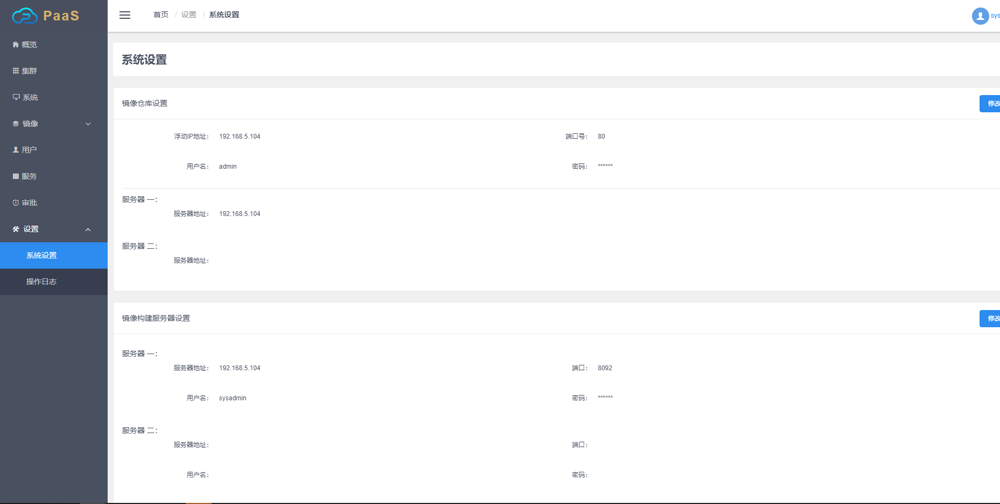

访问菜单-【集群】-新增集群，填写集群信息新增集群，其中三个key需要到已安装的k8s集群中的master节点上，查看/etc/kubernetes/admin.conf文件

集群地址填写master所在的ip，端口与https协议都是固定的

集群监控填写的时序数据库ip为集群master的ip，端口与http协议都是固定的，用户名密码为root/123456

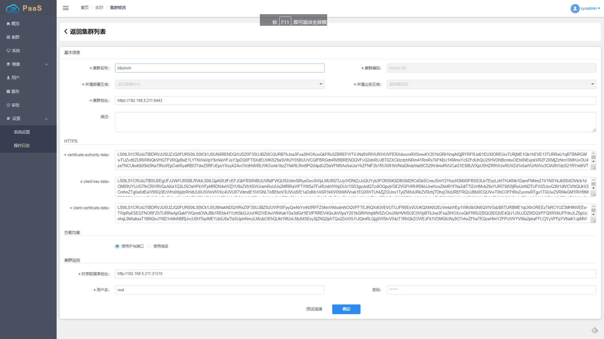

## Devops Server

### 安装

 

```
#创建文件夹
mkdir /opt/devops/devops-server/
chmod 777 /opt/devops/devops-server/

cd /opt/devops/devops-server/

#拷贝介质
cp /opt/devops/DevOps5.5/mirrors/software/tomcat/7/apache-tomcat-7.0.73.tar.gz /opt/devops/devops-server/
cp /opt/devops/DevOps5.5/mirrors/software/devops/server/* /opt/devops/devops-server
#mysql驱动
cp /opt/devops/DevOps5.5/mirrors/software/driver/mysql/mysql-connector-java-5.1.40.jar ./lib

#解压缩
tar -zxvf apache-tomcat-7.0.73.tar.gz

mkdir ./app_config
mkdir ./app_config/ROOT

#拷贝配置
cp /opt/devops/DevOps5.5/mirrors/playbook/roles/devops/templates/devops-startup.conf /opt/devops/devops-server/app_config/ROOT/startup.conf

mkdir /opt/devops/devops-server/webapps/ROOT
cp devops.war /opt/devops/devops-server/webapps/ROOT/

/opt/devops/devops-server/webapps/ROOT
unzip devops.war

#拷贝配置
cp /opt/devops/DevOps5.5/mirrors/playbook/roles/devops/templates/user-config.xml /opt/devops/devops-server/webapps/ROOT/WEB-INF/_srv/
vim /opt/devops/devops-server/webapps/ROOT/WEB-INF/_srv/user-config.xml

#然后对比tomcat文件夹,将里面的conf、lib、bin等其他缺少的文件夹整个拷贝过来
#尝试运行，根据提示修改对应参数
```

#### 破解

非正式license会限制用户以及项目数量

 

```
#破解需要准备tomcat下的两个文件，请先做好备份
/opt/devops/devops-server/webapps/ROOT/WEB-INF/lib/ptp-server-l7e-5.1.3.ipv6.jar
/opt/devops/devops-server/app_config/ROOT/license/primetonlicense.xml
#随后通过技术手段绕开验证
```

### 初始化

创建项目、创建员工那些不讲了，讲几个必要的配置

【管理平台】-【系统配置】-【服务集成】菜单可以集成之前安装的各个组件，记得都集成好

【管理平台】-【系统配置】-【系统信息】-【系统参数】菜单里需要配置以下信息

详细的参数说明见
http://doc.primeton.com/pages/viewpage.action?pageId=32737726

- Pcm.RootUrl，DevOps的根地址。配置成根url，比如http://192.168.5.104:8084/ 
- Ci.MavenSettings，这个配置很重要，表示maven的settings文件，而且此配置有多个级别，详情见:http://doc.primeton.com/pages/viewpage.action?pageId=30485680